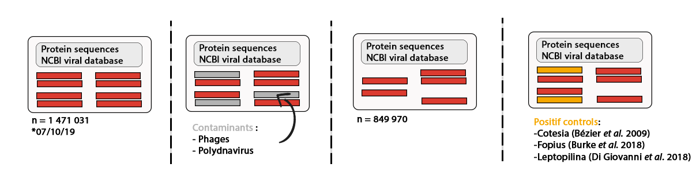
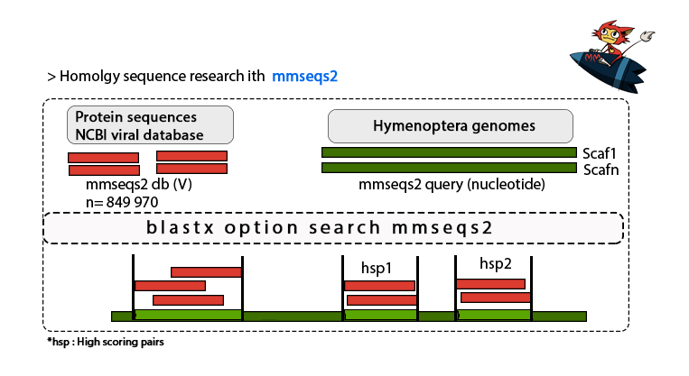
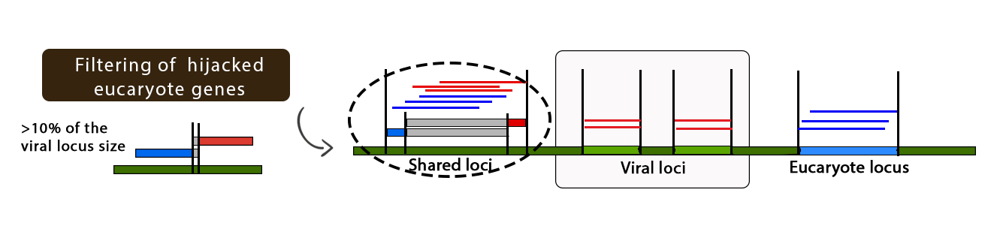
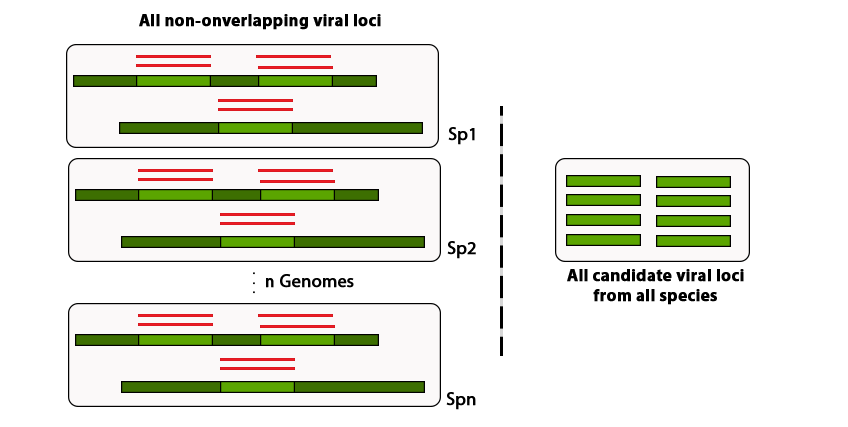
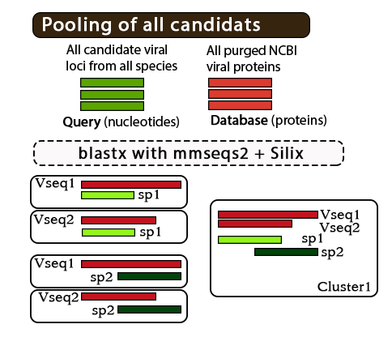
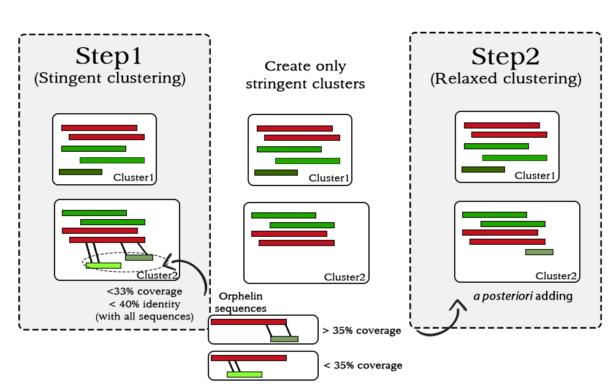

#Work in progress, all the code will be uploaded in few weeks with a tutorial.

The developed pipeline involves the creation of certain files in well-established positions in the arborescence to ensure optimal fluidity
when executing scripts, then the results will be written at these paths.


##Telechargement des Génomes 
1) Cette étape peut être effectuée en téléchargeant les génomes qui nous intéressent sur une platforme de partage de génomes assemblés comme NCBI. 

2) Une fois que tous les génomes sont téléchargés, il convient d'évaluer la qualité de l'assemblage de ces génomes: 

Commencons par créer le répértoire qui recevra pour chaque génome les statistiques d'assemblage:

```for dir in /beegfs/data/bguinet/these/Genomes/*; do mkdir -p $dir/Genome_assembly_statistics; done```

Executons ensuite un script pour créer des jobs python qui seront lancé sur slurm:

```python3 ~/these_scripts/Make_assembly_genome_stats_job.py -i /beegfs/data/bguinet/these/Species_genome_names.txt -p /beegfs/data/bguinet/these```

Executer tous les jobs pour calculer les statistiques d'assemblage:
```for file in Assembly_stat_job_*; do sbatch $file; done```


Ainsi avec QUAST, un nouveau répértoire : Genome_assembly_statistics est crée pour chacun des génomes


##Telechargement des bases de données nécessaires :
#NCBI viruses proteins database : https://www.ncbi.nlm.nih.gov/labs/virus/vssi/#/virus?SeqType_s=Protein&VirusLineage_ss=Viruses,%20taxid:10239

Le téléchargement impliquait le 07/10/19 1 471 031 séquences virales sous leurs formes protéiques. 

###########Enlever les séquences RefSeq pouvant être des contaminantes#########




1) Sélectionner dans NCBI - protein le mot clé ex: familles de phages, polydnavirus ...
2) Télacharger la liste d'accession 
3) Fusionner toutes les listes en une seule : 

```cat liste1.txt liste2.txt liste3.txt > liste_complette_conta_access_number.txt```

4) Eliminer les séquences Fasta ayant leur ID représenté dans la liste : "All_phages_and_polydnaviridae_families_conta.txt" :

Permet à partir d'un liste d'ID, de supprimer toutes les séquences d'un fichier fasta qui sont dans celle liste et d'ajouter les nouvelles séquences dans un nouveau fichier fasta.


```Purge_fasta_file.py -c /beegfs/data/bguinet/these/NCBI_protein_viruses/All_phages_and_polydnaviridae_families_conta.txt -f /beegfs/data/bguinet/these/NCBI_protein_viruses/All_viral_protein_sequences.fa -o /beegfs/data/bguinet/these/NCBI_protein_viruses/All_viral_protein_sequences_without_contamination.fa ```


5) Nous allons ajouter maintenant les contrôles positifs, c'est à dire les séquences déjà connues pour avoir été dommestiquées par des génomes eucaryotes. Nous allons également les targeter. 

Il faut déjà récupérer toutes ces séquences et les mettre dans un fichier fasta: Positif_controls_viral_domestication.fa
Nous allons ensuite targeter ces séquences avec le dénomination_CP pour Crontrôle positif :

```awk '/^>/{$1=$1"_CP"} 1' Positif_controls_viral_domestication.fa > Positif_controls_viral_domestication_targeted.fa```
```Explanation
awk '            ##Starting awk program here.
/^>/{            ##Checking condition if a line starts from > then do following.
  $1=$1"_CT"     ##Setting value of $1 to $1 and concatenating _CT to it too.
}                ##Closing BLOCK for this condition here.
1                ##Mentioning 1 will print edited/non-edited line.
' Input_file     ##Mentioning Input_file name here.
```
> Positif_controls_viral_domestication_targeted.fa

cat All_viral_protein_sequences_without_contamination.fa Positif_controls_viral_domestication_targeted.fa > All_viral_protein_sequences_without_contamination_controls.fa

6) Vérifier qu'il n'y ait pas de séquences dupliquées : 


#Bien débuter commence par bien organiser son espace de travail 
First of all the user will have to make a file in which will be present all the genomes that he wants to study in format: Genus_species.fa
in the format : 

```
/Project/file_with_genomes: 
	Genus_speciesA.fa 
	Genus_speciesB.fa 
	Genus_speciesC.fa 
	Genus_speciesD.fa 
 ```
 
 Then, we will transforme it as: 
 
 ```
 /Project/Genus_speciesA
	Genus_speciesA.fa

/Project/Genus_speciesB
	Genus_speciesB.fa

/Project/Genus_speciesC
	Genus_speciesC.fa

/Project/Genus_speciesD
	Genus_speciesD.fa
 ```
 
 By creating a new directory having the same name as the ```Genus_species.fa``` file 
 
```
 DIR="/Users/admin/Documents/"

for file in $(find /Project/file_with_genomes -name "*.fa") 
do 
  name=$(basename "$file" .fa)
  mkdir -p $DIR/Project/$name 
  cp "$file" $DIR/Project/$name 
  echo $name >> $DIR/Project/file_all_species_name.txt 
done
```

This will creates: 
* A file called ```file_all_species_name.txt``` where in each line are written the species names.
* And each directory with ```the Genus_species name```. 


#Recherche de gènes BUSCO pour chacun des génomes. #
####################################################

Nous allons maintenant pour chacun des Génome, lui créer des fichiers Busco (run_busco) dans lesquels seront adressés tous les résultats des recherches BUSCO 


# Créer dans chacun des directory d'espèce une fichier run_busco qui contiendra les résultats du run avec BUSCO.V3 ainsi qu'un répertoire pour les logs
for dir in $DIR/Project/*; do mkdir -p $dir/run_busco/busco_job.log/; done

#2) Ensuite, créer des fichiers jobs Busco pour chacune de ces espèces et l'ajouter dans le fichier Busco_jobs
 ```mkdir $DIR/Project/Scripts_pipeline/Busco_jobs ```


 ```python3 Make_job_busco.py -i /beegfs/data/bguinet/these/Species_genome_names.txt  -o /beegfs/home/bguinet/these_scripts/Busco_jobs -p /beegfs/data/bguinet/these/ ```

At the end of the process you should have the folowing message : 
----------------------------------------------------------------

                        Busco_job_maker.

----------------------------------------------------------------

[==================================================] 100.0% finish

132  files created at : /beegfs/home/bguinet/these_scripts/Busco_jobs


#3) Executer ensuite chacun de ces jobs 
 ```for file in $DIR/Project/Busco_job*; do sbatch $file; done ```

#4) Pour chacun des fichiers de chaque espèce, rassembler les séquences protéiques et nucléiques ensembles
# 4.1) Créer un directory receveur pour les séquences prot et nucl
 ```cat /beegfs/data/bguinet/these/Species_genome_names.txt | while read line; do  mkdir /beegfs/data/bguinet/these/Genomes/${line}/run_busco/run_${line}_BUSCO_v3/single_copy_busco_sequences/single_copy_busco_proteins; done ```
 ```cat /beegfs/data/bguinet/these/Species_genome_names.txt | while read line; do  mkdir /beegfs/data/bguinet/these/Genomes/${line}/run_busco/run_${line}_BUSCO_v3/single_copy_busco_sequences/single_copy_busco_nucleotides; done ```

# 4.2) Déplacer toutes les séquences dans les bon fichiers correspondants 
 ```cat /beegfs/data/bguinet/these/Species_genome_names.txt | while read line; do mv -v /beegfs/data/bguinet/these/Genomes/${line}/run_busco/run_${line}_BUSCO_v3/single_copy_busco_sequences/*.faa /beegfs/data/bguinet/these/Genomes/${line}/run_busco/run_${line}_BUSCO_v3/single_copy_busco_sequences/single_copy_busco_proteins/; done ```
 ```cat /beegfs/data/bguinet/these/Species_genome_names.txt | while read line; do mv -v $DIR/Project/M2/${line}/run_busco/run_${line}_BUSCO_v3/single_copy_busco_sequences/*.fna /beegfs/data/bguinet/these/Genomes/${line}/run_busco/run_${line}_BUSCO_v3/single_copy_busco_sequences/single_copy_busco_nucleotides/; done ```

# Etape pour créer la base de donnée mmseqs2 et permet également d'alleger le nom des séquences busco (attention étape non complette dans la suite pour 5espèces)
 ```cat /beegfs/data/bguinet/these/Species_genome_names.txt | while read line; do sed -i 's@:/beegfs/data/bguinet/these/Genomes/${line}/${line}.fa@@g' /beegfs/data/bguinet/these/Genomes/${line}/run_busco/run_BUSCO_v3/compiled_busco_aa ```

# 5) Récupérer un summary de tous les busco générés 
 ```python3 /beegfs/home/bguinet/M2_script/Busco_summary.py /beegfs/data/bguinet/these/Species_genome_names.txt ```


#########
#Recherche d'Homologie de séquence via MMseqs2. #
#########



#Premier mmseqs2 query = genome ; db : virus protein sequences

Créer une base de donnée virale MMseqs2 avec l'ensemble des séquences protéiques virales: 
#make mmseqs2 db for all viral proteins
 ```/beegfs/data/bguinet/TOOLS/MMseqs2/build/bin/mmseqs createdb /beegfs/data/bguinet/these/NCBI_protein_viruses/All_viral_protein_sequences_without_contamination_controls.fa /beegfs/data/bguinet/these/NCBI_protein_viruses/mmseqs2_viral_db ```

#make an index 
 ```/beegfs/data/bguinet/TOOLS/MMseqs2/build/bin/mmseqs createindex /beegfs/data/bguinet/these/NCBI_protein_viruses/mmseqs2_viral_db /beegfs/data/bguinet/these/NCBI_protein_viruses/tmp ```


#1) # Créer dans chacun des directory des Génomes d'espèces un fichier run_mmseqs2_V et Viral_mmseqs2_job.log
 ```for dir in */; do mkdir -p $dir/run_mmseqs2_V/Viral_mmseqs2_job.log/; done ```

#2) python make_busco_files.py short_file_species_name.txt 
 ```python3 Make_mmseqs2_jobs.py -i /beegfs/data/bguinet/these/Species_genome_names.txt -t virus -db /beegfs/data/bguinet/these/NCBI_protein_viruses/mmseqs2_viral_db -o /beegfs/home/bguinet/these_scripts/Mmseqs2_jobs -p /beegfs/data/bguinet/these ``` 

puis on execute chaque fichier.sh:

 ```for file in Viral_mmseqs2_job_*; do sbatch $file; done ```

#Génération d'un fichier Matches_i.m8

#récupération du tableau tblastn généré par busco directement inclu dans le fichier R Overlapping.R


####################################################
#Création des tables summary locus Virus et Hymeno.#
####################################################

# Ajout des brins et modification du sens des coordonées dans le fichier result_mmseqs2.m8

#For refseq mmseqs2
```cat /beegfs/data/bguinet/these/Species_genome_names.txt | while read line; do python3 Make_change_strand_blast.py -b /beegfs/data/bguinet/these/Genomes/${line}/run_mmseqs2_V/result_mmseqs2.m8 -o /beegfs/data/bguinet/these/Genomes/${line}/run_mmseqs2_V -t virus; done```

#For busco tblastn tab (because busco already did a tblastn research, we will take it from the source)
``` cat /beegfs/data/bguinet/these/Species_genome_names.txt | while read line; do python3 Make_change_strand_blast.py -b /beegfs/data/bguinet/these/Genomes/${line}/run_busco/run_BUSCO_v3/blast_output/tblastn_${line}_BUSCO_v3.tsv -o /beegfs/data/bguinet/these/Genomes/${line}/run_busco/run_BUSCO_v3/blast_output/ -t hymenoptera; done``` 

#Génération d'un fichier result_mmseqs2_strand_V.m8" de type "query", "tlen", "target", "pident", "alnlen", "mismatch", "gapopen","qstart", "qend", "tstart", "tend", "evalue", "bits", "strand"



#Passer dans R, afin de lancer R sur le serveur utiliser /beegfs/data/soft/R-3.5.2/bin/R
``` /beegfs/data/soft/R-3.5.2/bin/Rscript Overlapping_sequences.R /beegfs/data/bguinet/these/Species_genome_names.txt /beegfs/data/bguinet/these/Genomes/ #Permet d'executer le fichier . R``` 

#Création in fine de : 

# Matches_Apis_mellifera_strand_V.m8 : un fichier avec les brains d'affichés ainsi que les coordonnées changées de sens 
# Matches_",i,"_summary_V.txt : un fichier de type "seqnames" "start" "end" "width" "strand" "type" dans lequel les HSP sont rassemblés entre eux et ont une nouvelle coordonée 


#Recupération de tous les locus selon leurs coordonées dans les génomes de chaque espèces dans un seul fichier All_fasta_viral_loci.fna




```bash Recover_loci_sequences.sh /beegfs/data/bguinet/these/Genomes/ /beegfs/data/bguinet/these/Species_genome_names.txt```


#Clustering de gènes 

Make a Viral_sequence_loci directory 

```mkdir Viral_sequence_loci/mmseqs2_analysis```

Make a Clustering directory 

```mkdir /beegfs/data/bguinet/these/Clustering```

Création d'un premier run silix sur le blast de tous les loci contre les séquences protéiques virals de manière très stringent. Ceci permet de trouver les loci dits "partielles", c'est à dire des locus ne répondant pas aux seuils imposés, il s'agira alors vraisemblablement de loci ayant des similarités ponctuelles le long des séquences, pouvant alors êtres intérpétés comme étant des domaines orthologues très conservés, néanmoins ce genre de domaines très conservés ne seront pas assignés dans la plus part des cas dans des clusters puisque leur score de couvertrure est très bas. Aussi, traiter ces séquences comme étant des séquences partielles, nous permettra avec silix de les ajouter aux clusters de manière postérieur et ainsi éviter de prendre en compte ces séquences partielles lors de la créations des clusters. 


#First we will perform a blastx with mmseqs2 with the viral protein db created earlier as db and our viral nucleotides loci as queries 



(See if we have to split the data in order to be faster). 

```sbatch Job_mmseqs2_Viralprot_vs_Viral_loci.sh```

```for file in Job_mmseqs2_Viralprot_vs_Viral_loci_*.sh; do sbatch $file; done```

```cat *.m8 > Matches_Viralprot_vs_Viral_loci_result_all.m8```


#Change the order of the column len for silix 

```awk  '{FS="\t"; OFS="\t"}{print $1, $2, $3*100, $4, $5, $6, $7, $8, $9, $10, $11, $12, $13}' /beegfs/data/bguinet/these/Viral_sequence_loci/mmseqs2_analysis/Matches_Viralprot_vs_Viral_loci_result_all.m8 > /beegfs/data/bguinet/these/Viral_sequence_loci/mmseqs2_analysis/Matches_Viralprot_vs_Viral_loci_result2_all.m8```




Now we wil perform the first stringente silix clustering between Viral_seq_loci and the db 
First we will recreate the first file wich serve to indicate the sequence length , so we cat aa and dna sequences together

```cat /beegfs/data/bguinet/these/Viral_sequences_loci/mmseqs2_analysis/All_fasta_viral_loci.fna /beegfs/data/bguinet/these/NCBI_protein_viruses/All_viral_protein_sequences_without_contamination_controls.fa > /beegfs/data/bguinet/these/silix_concatenate_file_all.fa```

run the silix mode with stringent obtions 
```/beegfs/data/penel/programmes_ext/silix/silix-1.2.10-p1-simon/src/silix\ /beegfs/data/bguinet/these/silix_concatenate_file_all.fa\ /beegfs/data/bguinet/these/Viral_sequences_loci/mmseqs2_analysis/Matches_Viralprot_vs_Viral_loci_result2_all.m8\ -i 0.11 -r 1.2 --net -f cluster_  > /beegfs/data/bguinet/these/Genomes/Viral_sequences_loci/mmseqs2_analysis/seq_clusters_silix_stringent_all.fnodes```


Une fois ce silix effectué, nous allons identifier tous les clusters étant orphelins (donc les séquences protéiques). Un deuxième silix va ensuite être effectué, en ne prenant en compte dans le fichier blast, uniquement les candidats matchant avec une séquence protéique virale partielle, les paramètres réglés à 0, nous pourrons alors ensuite obtenir les couvertures et identités calculés par silix et ensuite filtrer les séquences candidates partielles les plus probables, et les réjouter ensuite au cluster original. 

L'idée est donc d'effectuer un nouveau silix avec un fichier tab blast ne contenant que les séquences dites partielles donc en éliminants tous les hits avec des protéines complettes. Pour cela nous devons identifier les séquences partielles. 

This sequence (orphelins) presents no sufficient similarity with any sequence of the database, bNon-orphan families are all families containing at least two sequences

#Only keep partials viral proteins (orphelins ones)

```
import pandas as pd 
tab = pd.read_csv("/beegfs/data/bguinet/these/Viral_sequences_loci/mmseqs2_analysis/seq_clusters_silix_stringent_all.fnodes",sep="\t",header=None)
#In order to keep only lonely clusters: 
df2 = tab[tab.groupby([0])[1].transform('size') == 1 ]
df2 =df2[~df2[1].str.contains(":")] 
with open("partials_locus_ids.txt","w") as file_partial_seq:
for ids in df2[1]: 
print(ids, file = file_partial_seq)``` 


Maintenant nous avons un fichier partials_locus_ids.txt qui contient tous les ids des séquences partielles, il suffit alors de ne garder que toutes les lignes du fichier blast qui contiennent un hit avec ces séquences-là

```import pandas as pd
blast_tab = pd.read_csv("Matches_Viralprot_vs_Viral_loci_result2_all.m8",header=None,sep="\t")
vals = []
with open('partials_locus_ids.txt', 'r') as a_file:
for line in a_file: 
vals.append(line.replace('\n',''))

blast_partial = blast_tab.loc[blast_tab[1].isin(vals)]
blast_partial.to_csv("Matches_Viralprot_vs_Viral_loci_result_partial.m8", sep='\t',header=None,index=False)```


No we get a new blast tab file wich only contain hit with a partial sequence 

The idea is now to make a silix run with 0 parameters and then only add the partials sequences in the clusters with a certain threshold 

```/beegfs/data/penel/programmes_ext/silix/silix-1.2.10-p1-simon/src/silix\
 /beegfs/data/bguinet/these/Viral_sequences_loci/silix_concatenate_file_all.fa\
 /beegfs/data/bguinet/these/Viral_sequences_loci/mmseqs2_analysis/Matches_Viralprot_vs_Viral_loci_result_partial.m8\
 -i 0 -r 0 --net -f cluster_  > /beegfs/data/bguinet/these/Viral_sequences_loci/mmseqs2_analysis/seq_clusters_silix_partials_all.fnodes```


#No we will only keep partials sequences that have a cov >= 0.35 and then add them into the clusters and merge the fnode file with the blast file

```python3 /beegfs/home/bguinet/M2_script/cluster_silix_merging.py
 -b /beegfs/data/bguinet/these/Viral_sequences_loci/mmseqs2_analysis/Matches_Viralprot_vs_Viral_loci_result2_all.m8\
 -c /beegfs/data/bguinet/these/Viral_sequences_loci/mmseqs2_analysis/seq_clusters_silix_with_partials_all.fnodes\
 -p /beegfs/data/bguinet/these/Viral_sequences_loci/mmseqs2_analysis/Matches_Viralprot_vs_Viral_loci_result_partial.net\
 -s /beegfs/data/bguinet/these/Viral_sequences_loci/mmseqs2_analysis/seq_clusters_silix_stringent_all.fnodes```


#Now we will collect information about taxa ID and genomic environment 

#################
# GET TAXID INF #
#################

##1 create sqlit database using taxadb in order to recover the taxa informations
```pip install taxadb```

```/beegfs/data/bguinet/myconda/bin/taxadb download -o taxadb
/beegfs/data/bguinet/myconda/bin/taxadb create -i taxadb --dbname taxadb.sqlite --fast```


#Get TAxid of all target protein seqs and add it on the column in the mergeed silix_blast dataframe

```python3 /beegfs/home/bguinet/M2_script/add_taxid_info.py -b /beegfs/data/bguinet/M2/Viral_sequences_loci/mmseqs2_analysis/dataframe_brute.txt -d /beegfs/data/bguinet/taxadb.sqlite -o /beegfs/data/bguinet/M2/Viral_sequences_loci/mmseqs2_analysis/Out_file.m8```

# A file  Out_file.m8 will be generated with cluster and taxid informations added 


#################
# GET ENV INF   #
#################

```python3 /beegfs/home/bguinet/M2_script/Add_genomic_env.py -i /beegfs/home/bguinet/M2_script/file_all_species_name_and_outgroup.txt -b /beegfs/data/bguinet/M2/Viral_sequences_loci/mmseqs2_analysis/Out_file.m8 -o /beegfs/data/bguinet/M2/Viral_sequences_loci/mmseqs2_analysis/Out_file_env.m8```

# A file  Out_file_env.m8 will be generated with cluster, taxid and genomic environment informations added .


#############################
# FILTERING OF CONTAMINANT. #
#############################


#In order to filter the possible contaminates we will do the following filtering on the candidats:

```import pandas as pd 

blast_tab = pd.read_csv("Out_file_env.m8",sep="\t")

NB_cluster_before= blast_tab['cluster_names'].nunique()
NB_scaff_before= blast_tab['query'].nunique()
NB_proteins_before= blast_tab['target'].nunique()

blast_tab = blast_tab[(blast_tab['pvalue_cov'] > 0.01) & (blast_tab['pvalue_gc'] > 0.01) & #Keep if the cov/gc pvalues  are both above 0.01
 (blast_tab['Number_busco_loci'] >= 1) | #Keep in there is at least one busco in the same scaffold
 (blast_tab['pvalue_cov'] > 0.01) | #Keep if the cov pvalue is above 0.01
 (blast_tab['pvalue_cov'].isnull()) & (blast_tab['pvalue_gc'] > 0.05) ] #If there is no coverage value, then keep candidats with a high GC pvalue. 

blast_tab[(blast_tab['pvalue_cov'].)]```


#################################
#####PHYLOGENY OF CLUSTERS.  ####
#################################


#Alignment of each clusters
for file in /beegfs/data/bguinet/M2/Gene_phylogeny/cluster_??????.fa ; do
echo "/beegfs/data/bguinet/M2/Gene_phylogeny/Alignment_clusters/run_Alignment.sh $file";
done > clustal_locus_align.cmds
python3 makeAlignements_scripts.py 10 clustal_locus_align.cmds

for file in Alignment_cluster_*; do
sbatch $file;
done


#Now that we aligned each cluster, we will concatenate all HSP togethers:

#Candidates HSPs are candidats that are in the same scaffold and same species, then they could be duplicates or HSPs. 
#A HSP is defined when the ratio between number of AA matching with another AA / nb AA matching with a gap is < 0.20.

python3 /beegfs/home/bguinet/M2_script/Merge_HSP_sequences_within_clusters.py -d /beegfs/data/bguinet/M2/Gene_phylogeny/Alignment_clusters/ -e .fa.aln

#Then we align these new cluster once again:
for file in /beegfs/data/bguinet/M2/Gene_phylogeny/Alignment_clusters/cluster_*.fa.aln_Hsp; do
echo "/beegfs/data/bguinet/M2/Gene_phylogeny/Alignment_clusters/run_Alignment.sh $file";
done > clustal_locus_align_HSP.cmds
python3 /beegfs/data/bguinet/M2/Gene_phylogeny/Alignment_script/makeAlignements_scripts_hsp.py 1 clustal_locus_align_HSP.cmds

for file in Alignment_cluster_*_hsp.sh; do
sbatch $file;
done

#Then we will rename these files in order to match the original cluster.aln name 
for file in /beegfs/data/bguinet/M2/Gene_phylogeny/Alignment_clusters/cluster_*.fa.aln_Hsp.aln; do
DEST=$(echo $file | sed 's/.fa.*/.fa.aln/')
rm $DEST
mv $file $DEST


